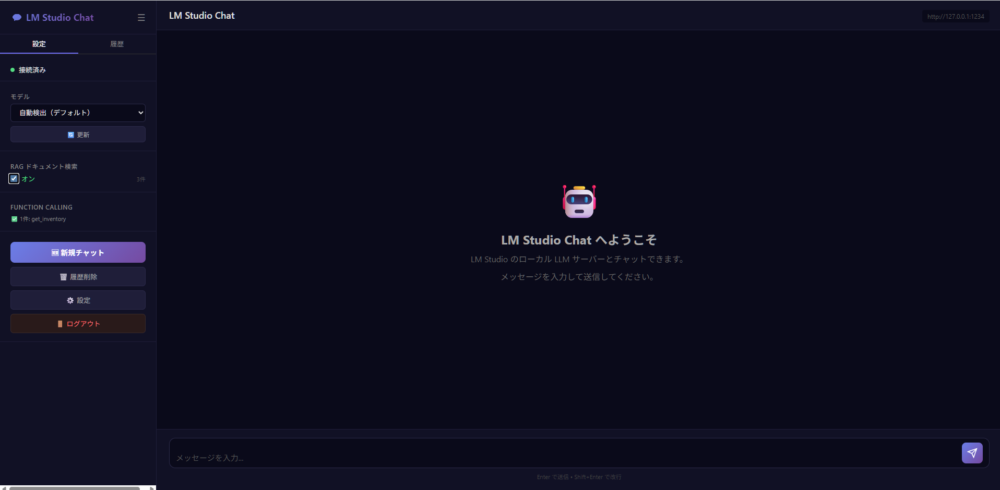
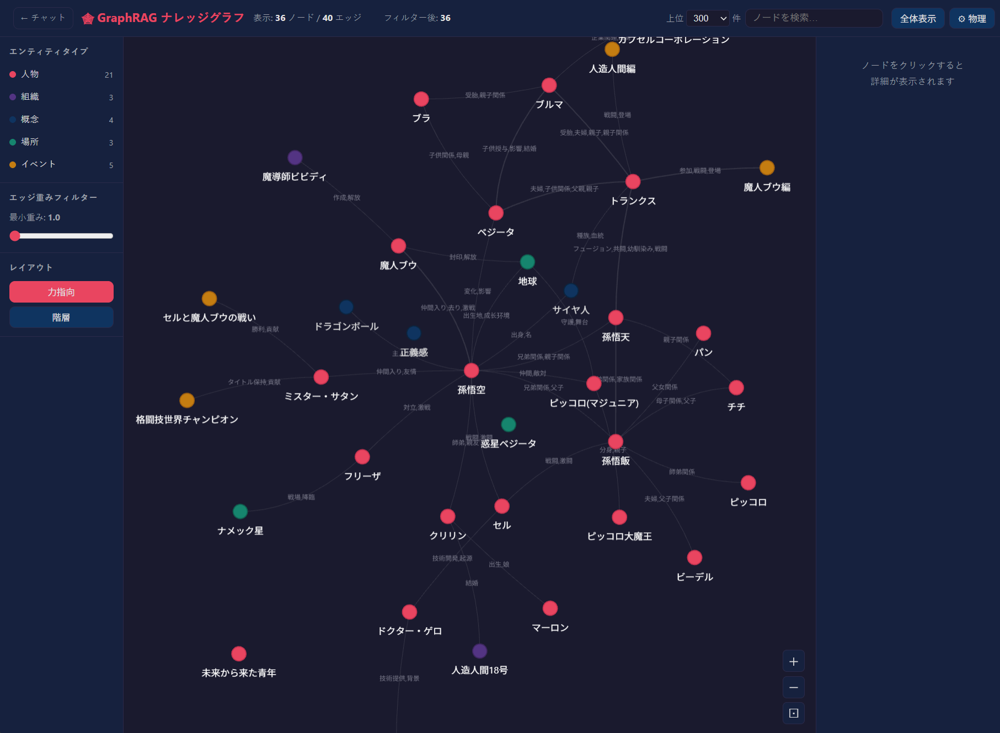
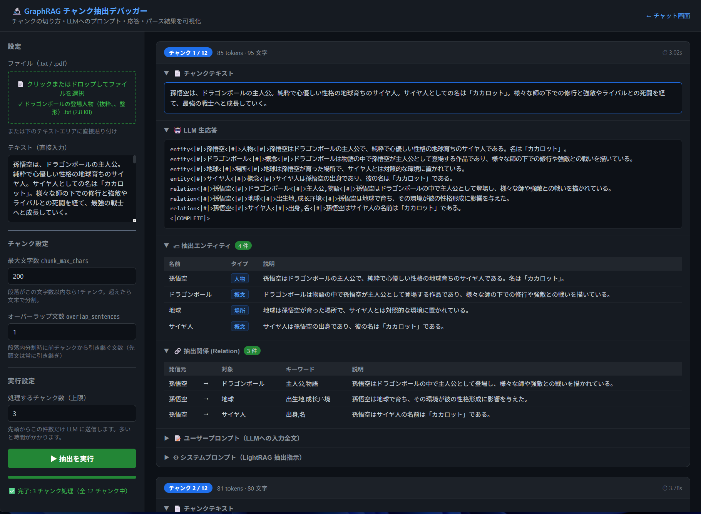
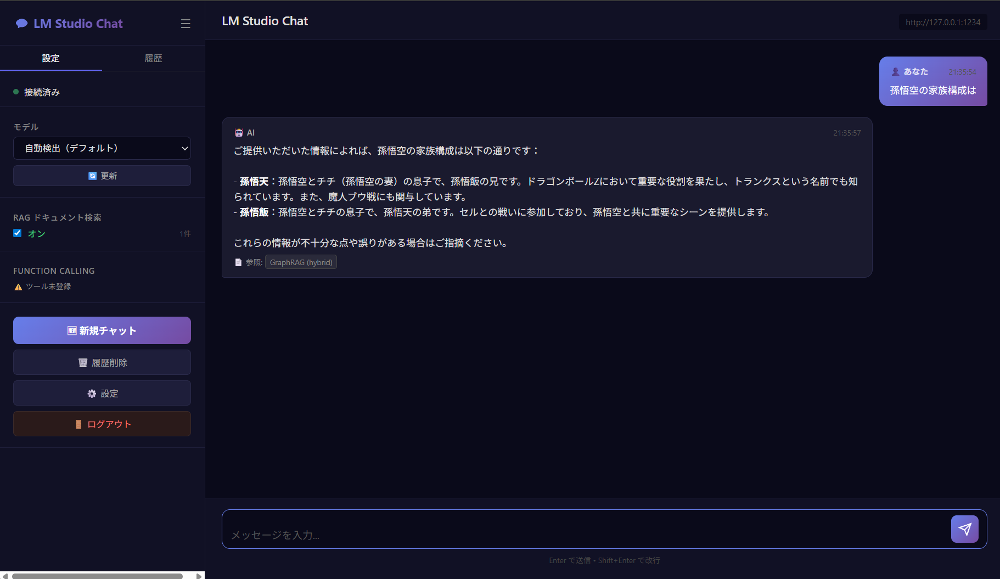

# LM Studio Chat with GraphRAG

LM Studio のサーバーモードに対応したチャット Web ツールです。  
RAG 機能に **GraphRAG（LightRAG）** を採用し、ドキュメント内のエンティティ（人物・組織・概念など）と関係性をナレッジグラフとして構築・検索します。  
構築したグラフの **インタラクティブ可視化**、および LLM へのプロンプト・応答を確認できる **チャンク抽出デバッガー** を内蔵しています。



---

## 目次

1. [システム構成](#システム構成)
2. [使用している主なツール・ライブラリ](#使用している主なツールライブラリ)
3. [GraphRAG 作成・登録の仕組み](#graphrag-作成登録の仕組み)
4. [グラフ可視化ツール](#グラフ可視化ツール)
5. [チャンク抽出デバッガー](#チャンク抽出デバッガー)
6. [検索モード](#検索モード)
7. [環境準備・起動方法](#環境準備起動方法)
8. [設定ファイル（.env）](#設定ファイルenv)
9. [利用方法](#利用方法)
10. [Function Calling / MCP 連携](#function-calling--mcp-連携)
11. [ディレクトリ構成](#ディレクトリ構成)
12. [トラブルシューティング](#トラブルシューティング)

---

## システム構成

```
┌──────────────────────────────────────────────────────────────────────┐
│                             ブラウザ                                  │
│  ┌──────────────┐  ┌─────────────────────┐  ┌─────────────────────┐  │
│  │ チャット画面  │  │ グラフ可視化 (/graph) │  │ デバッガー (/debug)  │  │
│  │ (chat.html)  │  │ (graph.html/vis.js)  │  │ (debug_rag.html)    │  │
│  └──────┬───────┘  └──────────┬──────────┘  └──────────┬──────────┘  │
└─────────┼────────────────────┼───────────────────────┼──────────────┘
          │ HTTP               │ HTTP                  │ HTTP (SSE)
┌─────────▼────────────────────▼───────────────────────▼──────────────┐
│                     FastAPI サーバー (main.py)                        │
│                                                                      │
│  ┌──────────────┐  ┌──────────────┐  ┌────────────┐  ┌───────────┐  │
│  │ /api/chat    │  │ /api/rag/*   │  │/api/graph/ │  │/api/rag/  │  │
│  │ チャット処理  │  │ RAG管理      │  │data        │  │debug/run  │  │
│  └──────┬───────┘  └──────┬───────┘  └─────┬──────┘  └─────┬─────┘  │
│         │                 │                │               │         │
│  ┌──────▼─────────────────▼───────────┐  ┌─▼──────────┐  ┌─▼──────┐  │
│  │      GraphRAGManager (rag.py)      │  │ graphml    │  │ debug  │  │
│  │  LightRAG / debug_extract()        │  │ パーサー   │  │extract │  │
│  └──────────────────┬─────────────────┘  └────────────┘  └────────┘  │
└─────────────────────┼────────────────────────────────────────────────┘
                   │ HTTP (OpenAI互換API)
┌──────────────────▼──────────────────────────────────────────┐
│                     LM Studio サーバー                       │
│                                                             │
│   ┌─────────────────────┐   ┌──────────────────────────┐   │
│   │   LLM モデル         │   │  エンベディングモデル      │   │
│   │ /v1/chat/completions│   │  /v1/embeddings          │   │
│   │ (エンティティ抽出・  │   │  (nomic-embed-text 等)   │   │
│   │  クエリ回答)         │   │                          │   │
│   └─────────────────────┘   └──────────────────────────┘   │
└─────────────────────────────────────────────────────────────┘
```

### 主なデータフロー

| 操作 | フロー |
|------|--------|
| ドキュメント登録 | ブラウザ → FastAPI → LightRAG → LM Studio（エンティティ抽出 + エンベディング）→ `lightrag_db/` に保存 |
| チャット（RAG あり） | ブラウザ → FastAPI → LightRAG グラフ検索 → LM Studio（回答生成）→ ブラウザ |
| グラフ可視化 | ブラウザ → FastAPI（graphml 解析）→ vis.js でレンダリング |
| 抽出デバッグ | ブラウザ → FastAPI（SSE）→ `debug_extract()` → LM Studio（チャンクごと）→ 逐次ストリーム表示 |

---

## 使用している主なツール・ライブラリ

| ツール / ライブラリ | 役割 |
|---|---|
| **[LM Studio](https://lmstudio.ai/)** | ローカル LLM サーバー。エンティティ抽出・チャット回答・テキストエンベディングを担当 |
| **[LightRAG (lightrag-hku)](https://github.com/HKUDS/LightRAG)** | GraphRAG エンジン。ドキュメントからエンティティ・関係性を抽出してナレッジグラフを構築・検索する |
| **[FastAPI](https://fastapi.tiangolo.com/)** | Python 製 Web フレームワーク。チャット API・RAG 管理 API・グラフデータ API を提供 |
| **[vis.js Network](https://visjs.github.io/vis-network/)** | ブラウザ上でのインタラクティブなグラフ可視化ライブラリ（CDN 経由） |
| **[httpx](https://www.python-httpx.org/)** | LM Studio の API に非同期 HTTP リクエストを送る |
| **[pypdf](https://pypi.org/project/pypdf/)** | PDF ファイルのテキスト抽出 |
| **[MCP (Model Context Protocol)](https://modelcontextprotocol.io/)** | Function Calling 経由で外部 MCP サーバーのツールを呼び出す |
| **[uv](https://docs.astral.sh/uv/)** | Python パッケージ・仮想環境管理ツール |

---

## GraphRAG 作成・登録の仕組み

通常の RAG（ベクトル検索）はテキストをチャンク単位で検索しますが、**GraphRAG はドキュメントからエンティティと関係性を抽出してナレッジグラフを構築し、グラフ構造を利用して検索**します。

### インデックス作成の全体フロー

```
TXT / PDF ファイル
       │
       ▼
  テキスト抽出
       │
       ▼
  チャンク分割（段落優先 → 文末補助・最大200文字）
       │
   ┌───┴───────────────────────────────────────┐
   │  各チャンクに対して並列処理                   │
   │                                            │
   │  ①  LM Studio LLM でエンティティ抽出        │
   │      ↓ 例:                                 │
   │      entity | 悟空 | 人物 | 孫悟空は…        │
   │      entity | カプセルコーポ | 組織 | …       │
   │      relation | 悟空 | ブルマ | 幼馴染, 冒険  │
   │                                            │
   │  ②  エンティティ・関係性をナレッジグラフに追加 │
   │      (GraphML 形式 + JSON KV ストア)         │
   │                                            │
   │  ③  LM Studio エンベディングモデルで          │
   │      エンティティをベクトル化（768次元等）     │
   └────────────────────────────────────────────┘
       │
       ▼
  lightrag_db/ に永続化
```

### 抽出するエンティティタイプ

本ツールでは日本語ドキュメントに合わせて以下のタイプを設定しています：

`組織` / `人物` / `概念` / `場所` / `イベント` / `製品`

### 作成される主なファイル（`lightrag_db/`）

| ファイル | 内容 |
|---|---|
| `graph_chunk_entity_relation.graphml` | ナレッジグラフ本体（GraphML 形式）。全エンティティとエッジを含む |
| `kv_store_full_entities.json` | ドキュメントごとのエンティティ名一覧 |
| `kv_store_full_relations.json` | ドキュメントごとの関係ペア一覧 |
| `vdb_entities.json` | エンティティのベクトルインデックス |
| `vdb_relationships.json` | 関係性のベクトルインデックス |
| `vdb_chunks.json` | テキストチャンクのベクトルインデックス |
| `kv_store_llm_response_cache.json` | LLM レスポンスキャッシュ（同一チャンクの再処理を省略） |
| `_indexed_docs.json` | 登録済みファイルの追跡情報 |

> ⚠️ **グラフデータ削除は注意してください。**  
> 再作成には LM Studio で長時間の LLM 処理が必要です。アプリ再起動時にグラフデータは自動的に保持されます。

### チャンク分割方式

LightRAG のデフォルトはトークン数固定でテキストを分割しますが、このツールでは **段落（空行区切り）を最優先** にした分割を採用しています。

#### 分割の優先順位

```
① 空行（\n\n）で段落に分割
       ↓ 段落が max_chars 以内 → そのまま1チャンク
       ↓ 段落が長い
② 。！？ で文に分割して積み重ね、超えたらチャンク確定
       ↓ 段落内分割が発生した場合
③ 先頭文（主語・話題を含む文）を次チャンクに引き継ぐ
```

#### なぜ段落優先か

「1エンティティ = 1段落」の文書（人物紹介・仕様書など）で、段落をまたいでオーバーラップすると  
**直前エンティティの記述が別エンティティのチャンクに混入**し、LLM が主語を誤認識します。

```
❌ 文末チャンカー（段落をまたぐ）:
  chunk 2: 「…最強の戦士へと成長していく。孫悟飯は…」← 悟空の文が混入

✅ 段落チャンカー:
  chunk 1: 「孫悟空は…最強の戦士へと成長していく。」← 1人で完結
  chunk 2: 「孫悟飯は…」                             ← 完全に別チャンク
```

#### 設定パラメータ

| パラメータ | デフォルト値 | 説明 |
|---|---|---|
| `chunk_max_chars` | 200 文字 | チャンクの最大文字数。段落がこれを超えた場合のみ文末分割を行う |
| `chunk_overlap_sentences` | 1 文 | 段落内分割が発生したときに引き継ぐ追加の文数（先頭文は常に引き継がれる） |
| `entity_extract_max_gleaning` | 0 | 2回目のエンティティ抽出を無効化（コンテキスト節約） |

`GraphRAGManager` の引数で変更できます：

```python
manager = GraphRAGManager(
    chunk_max_chars=300,         # LM Studio の Context Length が 8192 以上なら増やせる
    chunk_overlap_sentences=1,   # 段落内で分割が発生した場合の追加オーバーラップ文数
)
```

> **コンテキスト長の目安：**  
> LightRAG のエンティティ抽出プロンプトだけで 1,500〜2,000 トークンを消費します。  
> LM Studio の **Context Length が 4096** なら `chunk_max_chars=150〜200` が安全です。  
> **8192 以上**に設定すると `chunk_max_chars=300〜400` まで使えます（精度が向上します）。  
> コンテキスト超過時はログに `⚠️ コンテキスト超過` と表示されます。その場合は値を小さくするか LM Studio の Context Length を増やしてください。

---

## グラフ可視化ツール

構築したナレッジグラフをブラウザ上でインタラクティブに確認できるツールです。

**アクセス方法：** チャット画面の設定 → RAG セクションの「🕸 グラフを可視化」ボタン  
または直接 `http://localhost:8021/graph` へアクセス



### 主な機能

| 機能 | 説明 |
|---|---|
| **ノード表示** | エンティティを種類別の色で表示。接続の多いノードが中心に配置される |
| **エッジ表示** | 関係性をエッジで表示。太さはエッジの重み（関係の強さ）を表す |
| **表示件数切替** | 接続数上位 100 / 300 / 500 / 1000 / 全件 から選択（デフォルト 300） |
| **エンティティタイプフィルター** | 人物・組織・概念などの種類ごとに表示/非表示を切替 |
| **エッジ重みフィルター** | スライダーで弱い関係を非表示にしてグラフをシンプルに |
| **ノード検索** | 名前・説明でノードを検索してハイライト表示 |
| **ノード詳細** | クリックすると右サイドバーに説明文・関連エンティティ一覧を表示 |
| **レイアウト切替** | 力指向（クラスター表示）/ 階層（上下方向の親子関係表示） |
| **物理シミュレーション** | オン：ノードが自動整列して動く / オフ：ノードを固定して手動配置 |
| **ズームコントロール** | 画面右下のボタンでズームイン・アウト・全体表示 |

### エンティティタイプの配色

| タイプ | 色 |
|---|---|
| 人物 | 赤（`#e94560`） |
| 組織 | 紫（`#533483`） |
| 概念 | 紺（`#0f3460`） |
| 場所 | 緑（`#16856e`） |
| イベント | 橙（`#c47d11`） |
| 製品 | 青（`#1a6e9e`） |

---

## チャンク抽出デバッガー

GraphRAG のインデックス作成精度をチューニングするためのデバッグツールです。  
**チャンクの切り方・LLM へのプロンプト全文・LLM の生応答・パースされたエンティティ／関係** をチャンクごとに並べて確認できます。

**アクセス方法：** チャット画面の設定 → RAG セクションの「🔬 抽出デバッガー」ボタン  
または直接 `http://localhost:8021/debug` へアクセス



### 主な機能

| 機能 | 説明 |
|---|---|
| **ファイル読み込み** | `.txt` / `.pdf` をアップロード、またはテキストを直接貼り付け |
| **チャンク設定** | `chunk_max_chars`（最大文字数）と `overlap_sentences`（オーバーラップ文数）をその場で変更して比較できる |
| **処理件数の上限** | 先頭 N チャンクだけ LLM に送信して確認（全件処理は時間がかかるため） |
| **逐次表示（SSE）** | 1チャンク完了ごとに結果がリアルタイムで表示される |
| **チャンクテキスト** | 実際に LLM へ渡されるテキストを確認。段落境界・分割位置が意図通りか検証できる |
| **LLM 生応答** | `entity<\|#\|>…` / `relation<\|#\|>…` 形式の生テキストをそのまま表示 |
| **抽出エンティティ** | パース済みテーブル（名前・タイプ・説明）で一覧表示 |
| **抽出関係** | パース済みテーブル（発信元 → 対象・キーワード・説明）で一覧表示 |
| **プロンプト確認** | ユーザープロンプト・システムプロンプトを折りたたみで表示（本番と全く同じ内容） |

### 活用シーン

- チャンクが途中で切れて主語が消えていないか確認する
- LLM が期待するフォーマット（`entity<\|#\|>…`）で応答しているか確認する
- `chunk_max_chars` を変えながらエンティティ抽出件数の変化を比較する
- エンティティが 0 件のチャンクの原因（コンテキスト超過・フォーマット崩れなど）を特定する

---

## 検索モード

チャット画面の設定から RAG の検索モードを選択できます。`rag_config.json` に保存されます。

| モード | 説明 | 向いている質問 |
|---|---|---|
| **hybrid**（推奨） | local と global を統合して回答を生成 | 幅広い質問全般 |
| **local** | 特定エンティティ周辺のサブグラフを使って回答 | 「〇〇はどんな人？」など詳細を聞く質問 |
| **global** | ドキュメント全体のテーマ・構造を俯瞰して回答 | 「このドキュメントの主なテーマは？」などの全体把握 |
| **naive** | グラフを使わずシンプルなベクトル検索のみ | 従来 RAG に近い動作の確認 |

---

## 環境準備・起動方法

### 前提条件

- **LM Studio** がインストールされていること
  - チャット用 LLM モデル（コンテキスト長 **8192 トークン以上**推奨）をロード済みであること
  - エンベディングモデル（例：`nomic-embed-text`）をロード済みであること
  - サーバーモードが起動していること（デフォルト：`http://127.0.0.1:1234`）
- **Python 3.10 〜 3.13**
- **uv**（パッケージ管理）

### インストール手順

```bash
# 1. リポジトリをクローン
git clone https://github.com/TakkunRed/LMStudio-Chat-GraphRAG.git
cd LMStudio-Chat-GraphRAG

# 2. 仮想環境を作成
uv venv

# 3. 仮想環境をアクティベート
.venv\Scripts\activate        # Windows
# source .venv/bin/activate   # macOS / Linux

# 4. 依存関係をインストール
uv sync
```

### 設定ファイルの準備

`.env` ファイルをプロジェクトルートに作成します（`.env.example` があればコピーして編集）：

```ini
# ─── アプリ設定 ───────────────────────────────
APP_HOST=0.0.0.0
APP_PORT=8021
APP_USERNAME=admin
APP_PASSWORD=changeme

# ─── LM Studio 接続設定 ──────────────────────
LM_STUDIO_HOST=127.0.0.1
LM_STUDIO_PORT=1234
LM_STUDIO_API_KEY=lm-studio

# ─── GraphRAG（LightRAG）設定 ────────────────
LIGHTRAG_EMBED_MODEL=nomic-embed-text   # LM Studio にロードしているエンベディングモデル名
LIGHTRAG_EMBED_DIM=768                  # モデルの出力次元数（自動検出されるため通常変更不要）
LIGHTRAG_SEARCH_MODE=hybrid             # デフォルト検索モード
```

### サーバー起動

```bash
uv run python main.py
```

起動ログに `Application startup complete.` と `[GraphRAG] 初期化完了` が表示されれば準備完了です。

```
INFO:     Application startup complete.
[GraphRAG] 初期化完了 - ドキュメント数: 3, モデル: qwen2.5-7b-instruct
```

> **注意：** 起動時に LM Studio が起動・モデルロード済みである必要があります。接続できない場合、RAG 機能が無効になります（チャット自体は使用可能）。

### アクセス

ブラウザで以下にアクセスします：

```
http://localhost:8021
```

初期ユーザー名・パスワードは `.env` の `APP_USERNAME` / `APP_PASSWORD` を参照してください（デフォルト：`admin` / `changeme`）。

---

## 設定ファイル（.env）

| 変数名 | デフォルト | 説明 |
|---|---|---|
| `APP_HOST` | `0.0.0.0` | アプリのリッスンホスト |
| `APP_PORT` | `8021` | アプリのポート番号 |
| `APP_USERNAME` | `admin` | ログインユーザー名 |
| `APP_PASSWORD` | `changeme` | ログインパスワード |
| `LM_STUDIO_HOST` | `127.0.0.1` | LM Studio のホスト |
| `LM_STUDIO_PORT` | `1234` | LM Studio のポート |
| `LM_STUDIO_API_KEY` | `lm-studio` | LM Studio の API キー |
| `LM_STUDIO_LLM_MODEL` | （空）| 使用する LLM モデル名。空の場合は LM Studio にロード中のモデルを自動検出 |
| `LIGHTRAG_EMBED_MODEL` | `nomic-embed-text` | エンベディングモデル名 |
| `LIGHTRAG_EMBED_DIM` | `768` | エンベディング次元数（起動時に自動検出） |
| `LIGHTRAG_SEARCH_MODE` | `hybrid` | デフォルト検索モード |

---

## 利用方法

### ドキュメントを GraphRAG に登録する

1. チャット画面右上の「**設定**」を開く
2. 「**GraphRAG ドキュメント検索**」セクションの「**📄 ファイル追加**」をクリック
3. `.txt` または `.pdf` ファイルを選択する
4. 自動的にインデックス作成が開始される（LM Studio がエンティティを抽出するため、ドキュメントのサイズに応じて数分〜数十分かかります）
5. 完了後「**🔄 状態確認**」でドキュメント名が表示されれば登録完了

> `rag_docs/` フォルダにファイルをまとめて置いてから「**🗂️ フォルダ再スキャン**」でまとめて登録することもできます。

### GraphRAG 検索を使ってチャットする

1. チャット画面のテキストエリア左下「**RAG ドキュメント検索**」のチェックボックスをオンにする
2. メッセージを入力して送信する
3. GraphRAG がナレッジグラフを検索して関連情報を取得し、LLM への参考情報として注入した上で回答が生成される



### ナレッジグラフを可視化する

1. 「設定」→「🕸 グラフを可視化」ボタンをクリック（別タブで開く）
2. または `http://localhost:8021/graph` に直接アクセス
3. グラフが読み込まれたら、ノードをクリック・ドラッグして探索する

### チャンク抽出をデバッグする

抽出精度に問題がある場合や、チャンク設定を調整したい場合に使います。

1. 「設定」→「🔬 抽出デバッガー」ボタンをクリック（別タブで開く）
2. ファイルをアップロード、またはテキストを直接貼り付ける
3. チャンク設定（`chunk_max_chars` など）と処理件数（2〜3 件から始めると速い）を入力する
4. 「▶ 抽出を実行」をクリック
5. 結果がチャンクごとにカード形式で表示される
   - 📄 **チャンクテキスト**：文の切れ目・段落境界を確認
   - 🤖 **LLM 生応答**：フォーマット崩れ・空応答の原因を特定
   - 🏷 **抽出エンティティ** / 🔗 **抽出関係**：件数・内容を確認
   - 📝 **プロンプト**（折りたたみ）：LLM への入力全文を確認

---

## Function Calling / MCP 連携

LM Studio の Function Calling 機能を利用して、外部の **MCP サーバー** のツールを呼び出せます。  
RAG 検索と Function Calling は同時に使用できます。

### MCP サーバーの設定

`config.py` の以下の部分を使用したい MCP サーバーに合わせて修正してください：

```python
MCP_COMMAND = r"uv"
MCP_ARGS = [
    "run",
    "--directory",
    r"C:\path\to\your\mcp-server",
    "python",
    "server.py",
]
```

### ツールスキーマの設定

1. 設定画面の「**Function Calling ツール (JSON)**」に OpenAI 互換のツールスキーマを貼り付け、「**保存**」する
2. 保存したスキーマは `tools_config.json` に記録され、次回起動時も自動読み込みされる

サンプルスキーマは `Function Calling Sample JSON/` フォルダを参照してください。

### 動作シーケンス


---

## ディレクトリ構成

```
LMStudio-Chat-GraphRAG/
├── main.py                  # FastAPI アプリケーション本体
├── rag.py                   # GraphRAGManager（LightRAG ラッパー）
├── config.py                # 設定管理（.env 読み込み・MCP 設定）
├── pyproject.toml           # プロジェクト定義・依存関係
├── .env                     # 環境変数（git 管理外）
├── rag_config.json          # GraphRAG 検索モード設定
├── tools_config.json        # Function Calling ツールスキーマ
│
├── templates/
│   ├── chat.html            # チャット画面
│   ├── graph.html           # グラフ可視化画面
│   ├── debug_rag.html       # チャンク抽出デバッガー画面
│   └── login.html           # ログイン画面
│
├── static/
│   └── style.css            # スタイルシート
│
├── rag_docs/                # アップロードされたドキュメント格納場所
│
├── lightrag_db/             # GraphRAG データ（自動生成・削除禁止）
│   ├── graph_chunk_entity_relation.graphml  # ナレッジグラフ本体
│   ├── kv_store_*.json                      # エンティティ・関係性 KV ストア
│   ├── vdb_*.json                           # ベクトルインデックス
│   ├── kv_store_llm_response_cache.json     # LLM 応答キャッシュ
│   └── _indexed_docs.json                   # 登録済みドキュメント管理
│
├── images/                  # README 用画像
│   ├── GraphViewer.png      # グラフ可視化ツールのスクリーンショット
│   └── Debugger.png         # チャンク抽出デバッガーのスクリーンショット
└── Function Calling Sample JSON/
    └── Function Calling.json  # ツールスキーマサンプル
```

---

## トラブルシューティング

### ログに出るメッセージの一覧と対処

登録中に出るログメッセージの意味と対処をまとめます。

| メッセージ | 深刻度 | 原因 | 対処 |
|---|---|---|---|
| `Complete delimiter can not be found` | 無害 | LLM が終端マーカー `<\|COMPLETE\|>` を省略 | 無視でOK。処理継続 |
| `found N/4 fields on ENTITY` | **自動修正済み** | LLM の出力フォーマット崩れ | モンキーパッチで修正済み |
| `found N/5 fields on RELATION` | **自動修正済み** | LLM の出力フォーマット崩れ | モンキーパッチで修正済み |
| `Entity extraction error: invalid entity type` | 軽微 | LLM がエンティティタイプに記号・引用符を含む値を出力 | 該当エンティティのみ破棄。処理継続 |
| `400エラー - 全メッセージをサニタイズして再試行` | 自動回復 | `<\|#\|>` が LM Studio のトークナイザーを誤動作させる | 自動リトライで回復 |
| `再試行後も400エラー - チャンクをスキップ` | 軽微 | リトライ後も 400 が続く | そのチャンクのみスキップ。処理継続 |
| `⚠️ コンテキスト超過 - チャンクをスキップ` | **要対応** | LM Studio の Context Length が小さすぎる | LM Studio でモデルの Context Length を 8192 以上に設定する |
| `Failed to extract entities and relationships` | 要確認 | LLM タイムアウト・接続切断など | LM Studio が起動中か確認 |

---

### RAG 初期化に失敗する

**症状：** 起動時に `[GraphRAG] 初期化失敗（RAG機能は無効）` と表示される  
**原因：** LM Studio が起動していない、またはモデルがロードされていない  
**対処：** LM Studio を起動してモデルをロードしてからアプリを再起動する

---

### ドキュメント登録中に 400 エラーが出る

**症状：** `[GraphRAG LLM Error] 400: Failed to parse input at pos 0: entity<|#|>...`

**原因：** LightRAG はエンティティ抽出時に、前チャンクの抽出結果（`entity<|#|>名前<|#|>...` 形式の文字列）をシステムプロンプトや history に注入することがあります。その `<|#|>` を LM Studio 内部の llama.cpp が特殊トークン記号として誤認識し、400 エラーを返します。

**対処：** `rag.py` の `llm_func` に 2 段階のフォールバック処理が実装されており、自動的に回避されます。

| 段階 | 動作 |
|---|---|
| 通常リクエスト | `prompt` と `history_messages` の `<\|#\|>` を ` \| ` に変換して送信 |
| ① 1回目リトライ | 400 が返ったら `system_prompt` を含む全メッセージを同様にサニタイズして再送 |
| ② 2回目リトライ | それでも 400 なら `""` を返してそのチャンクをスキップし、次のチャンクへ継続 |

---

### ドキュメント登録中に WARNING が出る（フィールド数エラー）

**症状：**
```
WARNING: chunk-XXXX: LLM output format error; found 5/4 fields on ENTITY
WARNING: chunk-XXXX: LLM output format error; found 4/5 fields on RELATION
```

**根本原因：** LLM（特に 7B 前後の小型モデル）は、LightRAG が期待するフィールド数（エンティティ: 4、関係: 5）を守らない出力をすることがあります。また、LightRAG 内部の `fix_tuple_delimiter_corruption()` が変形区切り子を変換することでフィールドが増加することもあります。

**対処（自動）：** `rag.py` で LightRAG の内部ハンドラー（`_handle_single_entity_extraction` / `_handle_single_relationship_extraction`）をモンキーパッチして、フィールド数を **WARNING が出る直前** に強制正規化しています。

```
entity  (4フィールド期待): フィールド過多 → 余分を description に結合
                         フィールド不足 → "-" で末尾補完
relation(5フィールド期待): フィールド過多 → 余分を description に結合
                         4フィールド   → keywords を "-" で補完し description を保持
```

起動ログに以下が表示されていれば、パッチは正常に適用されています：
```
[GraphRAG] LightRAG ハンドラーにフィールド数正規化パッチを適用しました
```

**なぜモデル専用ロジックにしないか：** LLM ごとに出力パターンが異なるため、出力後処理でカバーしようとするといたちごっこになります。このパッチは「どんな LLM が何を出力しても、最終的な検証直前で正規化する」アプローチをとっているため、モデル非依存です。

---

### ドキュメント登録中に `invalid entity type` エラーが出る

**症状：** `Entity extraction error: invalid entity type in: ['entity<|関係', ...]`

**原因：** LLM が関係レコードをエンティティ形式で誤出力し、エンティティタイプのフィールドに `'`（引用符）や `<`（山括弧）などの禁止文字が含まれた場合に、LightRAG 内部の型検証で弾かれます。

**対処：** 該当のエンティティのみグラフに登録されませんが、処理全体は継続されます。大量に出る場合はモデルのコンテキスト長を増やすか、より大きいモデルの使用を検討してください。

---

### コンテキスト長超過エラー（n_keep >= n_ctx）

**症状：** `n_keep: XXXX >= n_ctx: 4096` のようなエラーがログに出る  
**原因：** LM Studio でロードしているモデルのコンテキスト長が不足している  
**対処：** LM Studio の設定でモデルの「Context Length」を **8192 以上**（推奨：16384）に設定する

---

### 再起動後にグラフ検索の結果が返らない

**症状：** 以前は動いていたのに再起動後、検索結果が空になる  
**原因（過去の既知バグ）：** 起動時の次元数自動検出処理でグラフデータが消去されていた（修正済み）  
**確認方法：** `lightrag_db/_indexed_docs.json` にドキュメント名が残っているか確認する

---

### エンベディング次元数ミスマッチエラー

**症状：** `Embedding dimension mismatch` エラーが出る  
**原因：** `.env` の `LIGHTRAG_EMBED_DIM` とエンベディングモデルの実際の出力次元数が違う  
**対処：** アプリ起動時に自動検出して修正されます。`LIGHTRAG_EMBED_DIM` は設定しなくても動作します

---

### グラフ可視化画面が重い

**症状：** `/graph` を開いたときにブラウザが固まる  
**原因：** 表示件数が多すぎる（デフォルト 300 件）  
**対処：** 画面上部の件数セレクターで「100」を選択する。または物理シミュレーションをオフにする
